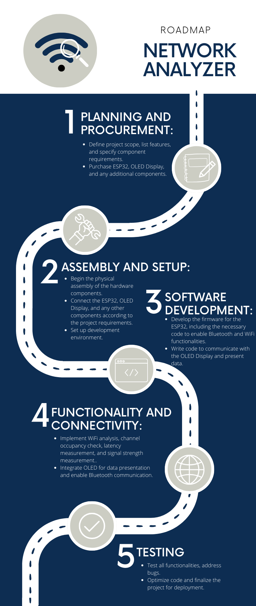

<h1 id="esp32-based-network-analyzer-" align="center"><b>ESP32 based Network Analyzer 🛜</b></h1>

A project focused on creating a standalone, open-source, cheap in-production wireless network analyzer.

<!-- DESCRIPTION -->
<h2 id="specification"  align="center">Specification</h2>

Based on ESP32 microcontroller with built-in Bluetooth and WiFi modules and attached OLED display communicating with the main board over SPI interface.

<!-- COMPONENTS -->
<h2 id="components">Components</h2>
<ul>
<li><a href="https://botland.com.pl/moduly-wifi-i-bt-esp32/8893-esp32-wifi-bt-42-platforma-z-modulem-esp-wroom-32-zgodny-z-esp32-devkit-5904422337438.html" target="_blank">ESP32 (BT+WiFi)</a> </li>
<li><a href="https://www.waveshare.com/2.4inch-lcd-module.htm">LCD Display Module 2.4inch</a> </li>
</ul>

<!-- FEATURES -->
<h2 id="features">Features</h2>
<ul>
<li>Standalone system</li>
<li>Live WiFi network analysis</li>
<li>WiFi networks fetching</li>
<li>Checking the channel occupancy</li>
<li>Measuring network latency </li>
<li>Measuring signal strength</li>
<li>Data presentation on OLED screen</li>
<li>Sending information about nearby WiFi networks to a smartphone over Bluetooth</li>
</ul>

<!-- ROADMAP -->
<h2 id="roadmap">Roadmap</h2>

  

<!-- WORKSHARING -->
<h2 id="worksharing">Work Sharing</h2>
<table style="width:200%">
  <tr>
    <th width=250px>Oliwia</th>
    <th width=250px>Michał</th>
    <th width=250px>Paweł</th>
  </tr>
  <tr>
    <td>&#x23F3; Readme</td>
    <td>&#x23F3; Readme</td>
    <td>&#x23F3; Readme</td>
  </tr>
  <tr>
    <td>&#x2705; Roadmap</td>
    <td>&#x2705; Pinout and connection</td>
    <td>&#x2705; Pinout and connection</td>
  </tr>
</table>

<!-- DOCS -->
<h2 id="documentation">Documentation</h2>

<a href="https://docs.google.com/document/d/1zGVxelh6Lqd8fTjk6PqKxtoFgIcpbrBV/edit?usp=sharing&ouid=104207368821701978385&rtpof=true&sd=true" target="_blank">Open Documentation</a>

<!-- CREATORS -->
<h2 id="authors">Authors</h2>
<ul>

<li>[<a href="https://www.github.com/OliwiaKubic">@Oliwia Kubic</a>]</li>
<li>[<a href="https://www.github.com/pewexxx">@Paweł Kuźniar</a>]</li>
<li>[<a href="https://github.com/MichalWilczak">@Michał Wilczak</a>]</li>

</ul>

<!-- FOOTER -->
Our is project realised within Design Laboratories at <a href="https://www.agh.edu.pl/">AGH UST</a>.

